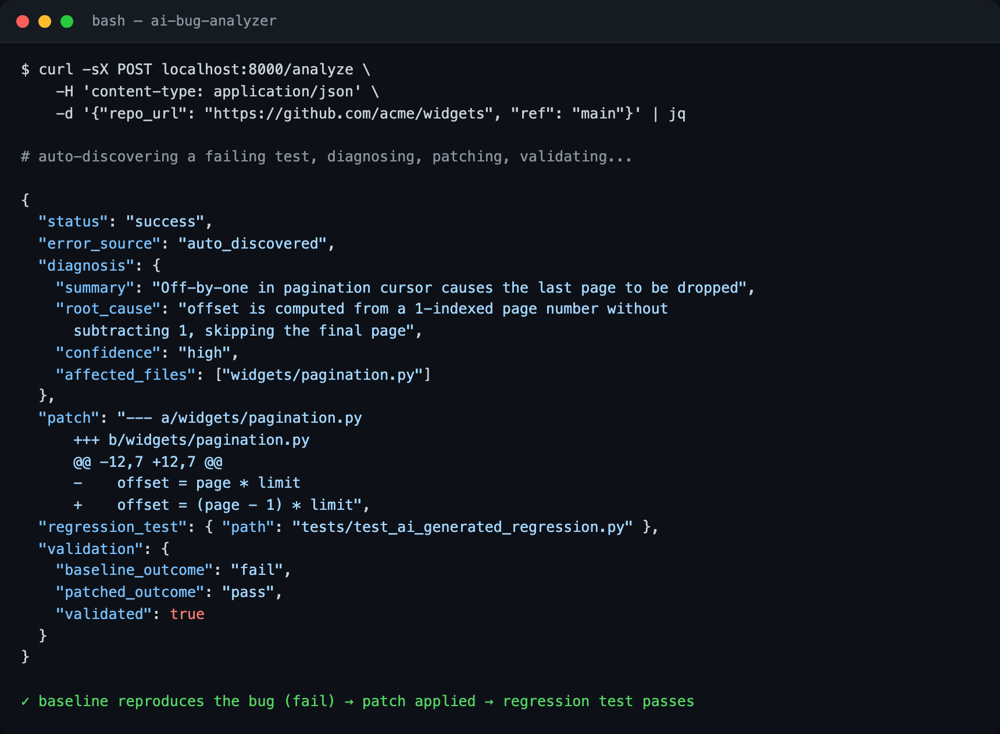

# AI Bug Investigation Assistant

See [docs/ARCHITECTURE.md](docs/ARCHITECTURE.md) for an architecture diagram.

An AI-assisted developer tool that analyzes application errors in a GitHub repository,
proposes a fix as a unified diff, and generates a regression test — then validates the
fix itself by running the test in a disposable clone before it's ever handed back to you.


*Example `/analyze` request and response (abbreviated for illustration).*

## How it works

1. You give it a GitHub repo URL and a ref (branch, commit SHA, or PR number/URL).
2. It clones the repo into a temporary workspace. If you don't supply an
   `error_description`, it runs the repo's own test suite to find a failing test.
3. It sends the traceback and surrounding source code to Claude, which returns a
   diagnosis, a patch, and a regression test.
4. It applies the patch and runs the regression test **only inside the disposable
   clone** — first against the unpatched code (expecting it to fail, proving the test
   reproduces the bug), then against the patched code (expecting it to pass).
5. It returns the diagnosis, patch, generated test, and validation result. **Your
   actual repository is never modified** — you apply the patch yourself if you're
   happy with it.

## Running locally

```bash
pip install -e .[dev]
cp .env.example .env   # fill in ANTHROPIC_API_KEY
uvicorn app.main:app --reload
```

## Running with Docker

```bash
docker build -t ai-bug-analyzer .
docker run -e ANTHROPIC_API_KEY=$ANTHROPIC_API_KEY -p 8000:8000 ai-bug-analyzer
```

## Usage

```bash
curl -X POST localhost:8000/analyze \
  -H 'content-type: application/json' \
  -d '{
        "repo_url": "https://github.com/<owner>/<repo>",
        "ref": "main"
      }'
```

Or supply a known error explicitly instead of relying on auto-discovery:

```bash
curl -X POST localhost:8000/analyze \
  -H 'content-type: application/json' \
  -d '{
        "repo_url": "https://github.com/<owner>/<repo>",
        "ref": "main",
        "error_description": "Traceback ...: IndexError: list index out of range"
      }'
```

`ref` also accepts a PR number (`"42"`), a PR URL, or a commit SHA.

## Testing

```bash
pytest -q
```

All tests run fully offline: GitHub API calls are mocked with `respx`, git operations
run against local bare repos created on the fly, and the Anthropic client is a fake
injected into `LLMClient` — no real API key or network access is needed to run the
suite.

## Scope / limitations

- Public GitHub repos over HTTPS (an optional `GITHUB_TOKEN` env var raises rate
  limits and enables private-repo access).
- Python target repos only; dependency installation before test discovery is
  best-effort (`requirements.txt` or a `pyproject.toml`/`setup.py`).
- The sandbox guards against runaway/resource-exhausting subprocesses (timeouts,
  memory/CPU limits, killing the whole process group), not a fully malicious
  repository executing arbitrary code during install or test collection — real
  adversarial sandboxing (gVisor/firecracker) is out of scope.
- Requests are handled synchronously; `MAX_CONCURRENT_ANALYSES` caps how many run
  at once.
