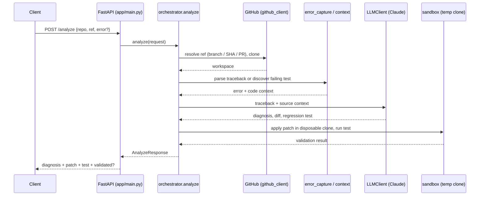

# Architecture

A FastAPI service: given a repo + ref, it diagnoses a failure with Claude, proposes a patch and regression test, and validates them in a disposable clone before returning.

| Module | Role |
|---|---|
| `config.py` | Settings (model, tokens) |
| `github_client.py` | Parse URLs/PRs, clone |
| `error_capture.py` / `context.py` | Find failing test, extract surrounding code |
| `llm.py` | Anthropic SDK, structured output validated with Pydantic |
| `sandbox.py` / `subprocess_utils.py` | Isolated patch + test execution |
